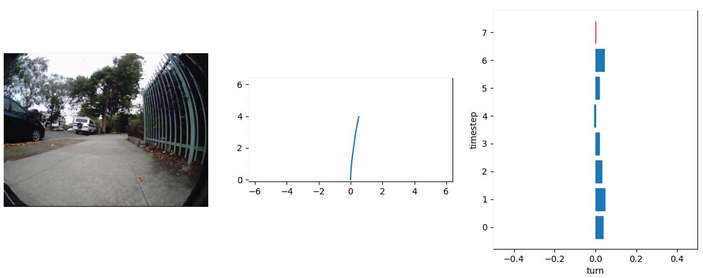
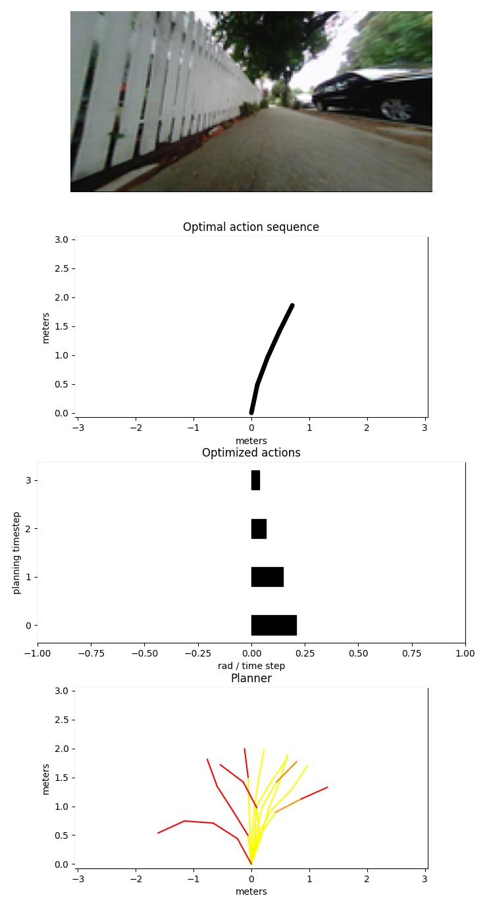

# LaND: Learning to Navigate from Disengagements

Gregory Kahn, Pieter Abbeel, Sergey Levine

[Website link](https://sites.google.com/view/sidewalk)


### Pre-installation

- Ubuntu 16.04 (although other versions may work)
- [miniconda](https://docs.conda.io/en/latest/miniconda.html)

### Installation

Clone this repository.

Setup the anaconda environment:
```
conda env create -f install/environment.yml
```

Add the following to your `~/.bashrc` file (replacing `<SIDEWALK_PATH>` appropriately):
```
activate_sidewalk () {
    export PYTHONPATH=<SIDEWALK_PATH>/src:$PYTHONPATH
    conda activate sidewalk
}
```

When you want to run the code, make sure to first run `activate_sidewalk` in your terminal.


### Run

#### Data Visualization

You can walk through the data by running the following command:
```
python scripts/hdf5_visualizer.py -folders experiments/hdf5s
```

To step through the trajectories, use the keyboard:
```
q: quit
e: next timestep
w: prev timestep
d: next file
s: prev file
c: next end of file
x: prev end of file
1-9: skip forward by that many timesteps
```



#### Evaluation

Create the experiments folder in the root directory
```
mkdir experiments
```

Download the contents of [this folder](https://drive.google.com/drive/folders/16xUhGaWullmpaZJKzyltPWLbRx-kKjOS?usp=sharing) and unzip the contents.

Run the evaluation script for our method:
```
python scripts/eval.py configs/ours.py --model experiments/ours/ckpts/ckpt-7
```

You can step through the trajectories using the same keyboard commands used for the data visualization.



You can also run the behavioral cloning baseline:
```
python scripts/eval.py configs/bc.py --model experiments/bc/ckpts/ckpt-1
```


#### Training

If you would like to train the models yourself, first delete `experiments/ours` and `experiments/bc`. Then train our method:
```
python scripts/train.py configs/ours.py
```
and then train the behavioral cloning method:
```
python scripts/train.py configs/bc.py
```
